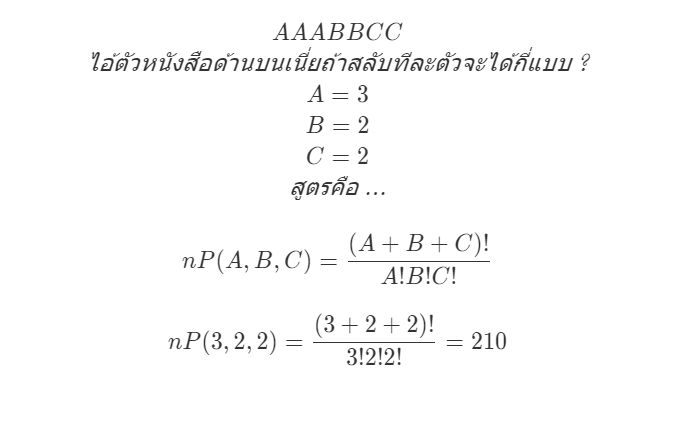
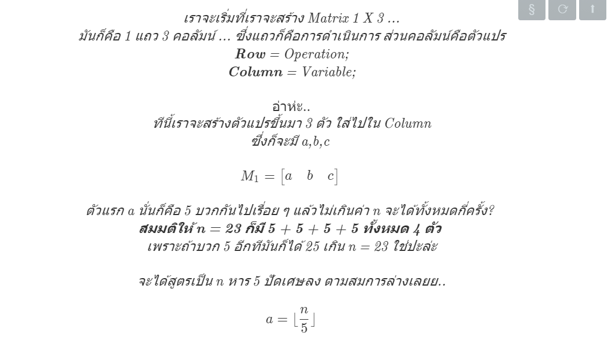
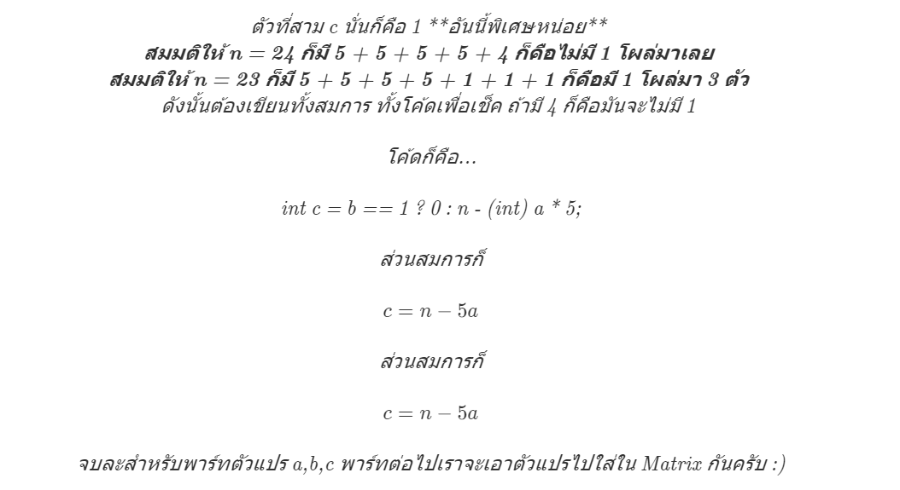
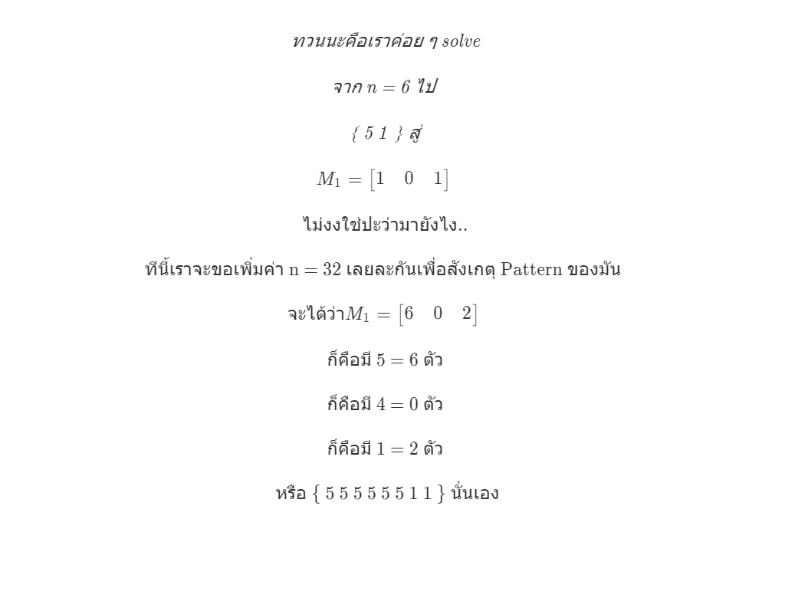
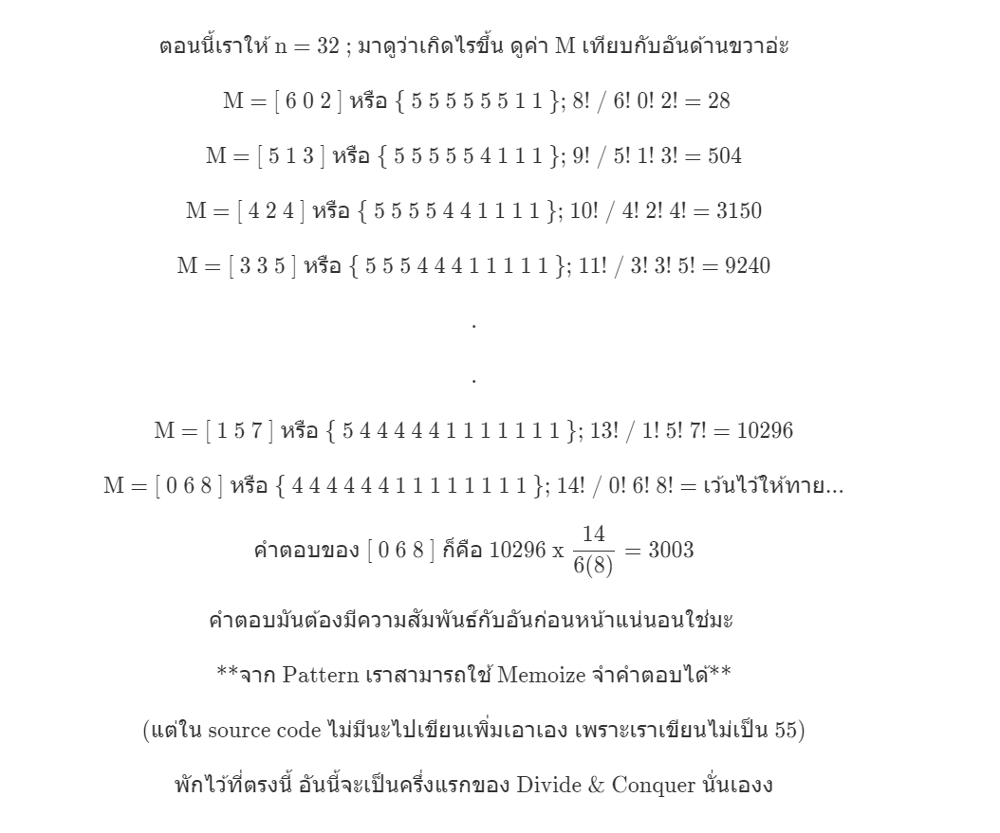
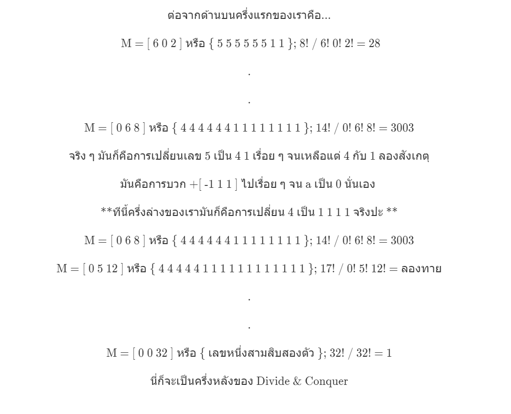
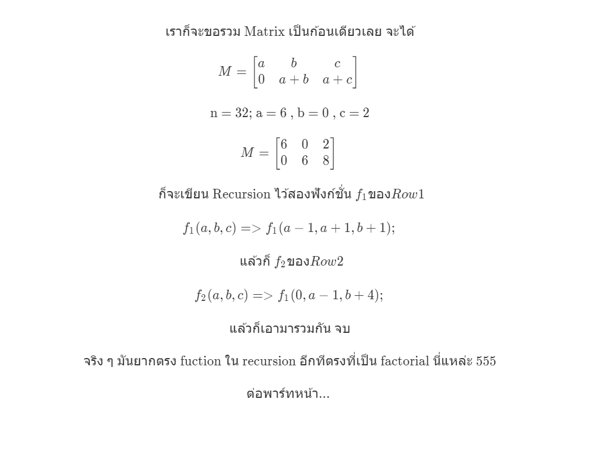
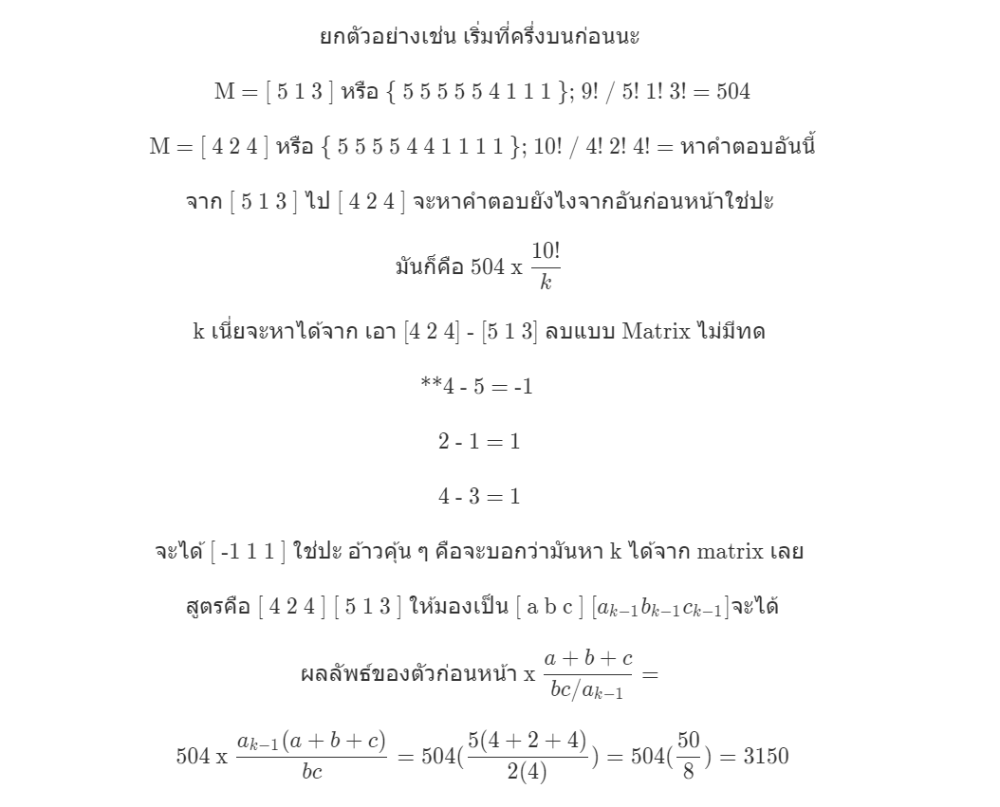

### Exercise

หุ่นยนต์รุ่นหนึ่งสามารถกระโดดได้ 3 แบบคือ 1 ขั้น หรือ 4 ขั้น หรือ 5 ขั้น
เช่นต้องการกระโดดไปชั้นที่ 6 ทำได้หลายวิธี เช่น

-   A. 1/5 คือ กระโดด 1 ขั้น ตามด้วยกระโดด 5 ขั้น
-   B. 5/1 คือ กระโดด 5 ขั้น ตามด้วยกระโดด 1 ขั้น
-   C. 1/1/4
-   D. 1/4/1
-   E. 4/1/1
-   F. 1/1/1/1/1/1

นั่นคือกระโดดได้ 6 วิธี ให้เขียนโค้ดเพื่อหาว่า ถ้าต้องการกระโดดไปขั้นที่ n จะสามารถกระโดดได้กี่วิธี

-   ใช้ Iteration 20%
-   ใช้ Recursion 20%
-   ใช้ Recursion และ Memoization 20%
-   ใช้ Divide & Conquer และ Matrix 40%

**ข้อนี้มูลค่ารายได้ 40K ต่อเดือนจากเพจต้นทาง [CodeStar FB](https://www.facebook.com/codestar.work/photos/a.355085531361402/896522623884354/?type=3&theater)
### How to do ?

-   ในนี้จะใช้ Matrix + Recursion + Divide & Conquer ส่วน memoize เอาโค้ดไปแก้เองเลยฮะ 55 เขียนไม่เป็น ไม่เก่งงะ
-   ต่อมาก็ Math Knowledge ก็มี Matrix & เรียงสับเปลี่ยน & factorial

### สมการของ "เรียงสับเปลี่ยน"



<!-- ```math
AAABBCC\\
\textit{ไอ้ตัวหนังสือด้านบนเนี่ยถ้าสลับทีละตัวจะได้กี่แบบ ?}
\\
A = 3 \\
B = 2 \\
C = 2 \\
\textit{สูตรคือ ...}\\ {}
\\

nP(A,B,C) = \frac{(A+B+C)!}{A!B!C!}\\ {}

\\
nP(3,2,2) =  \frac{(3+2+2)!}{3!2!2!} =210 \\ {}
``` -->

### สมการของ "Matrix"

-   ขี้เกียจเขียน เอาเป็นว่าลองไปอ่านโพสนี้ละกัน ลิ้งค์ด้านล่าง
-   [Link](https://www.facebook.com/panpilachanon/posts/576551232764120?__xts__[0]=68.ARBwh_kdwCJjnT5XH5m5o_hqDUofGqNIkf0otyw1zB6C56gshsWm1SUvCXLdxdqQqa4UvwlUA2_lCKQkh3or55qXwy8qRzU-tjMiS-LKv80JAaN2AJroWrC7Ej0W3GagZuM_P1MU2Pd7vmsag2M3Tk5EoANu7GzV8irNh8RrthMFGeFPfKE1&__tn__=-R)

### ต่อที่มาลองทำเล่น ๆ กัน สมมติให้ n = 6 ตามโจทย์เลย คิดไง ?

-   **ก็เริ่มที่ { 1 4 5 } อะไรบวกกันได้ 6 บ้าง ?**
-   5 + 1 = 6
-   4 + 1 + 1 = 6
-   1 + 1 + 1 + 1 + 1 + 1 = 6
-   ลองมาเขียนเรียงกันจะได้
-   { 5 1 } --> เข้าสูตรเรียงสับเปลี่ยน = 2! / 1!1! = 2
-   { 4 1 1 } --> เข้าสูตรเรียงสับเปลี่ยน = 3! / 1!2! = 3
-   { 1 1 1 1 1 1 } --> เข้าสูตรเรียงสับเปลี่ยน = 6! / 6! = 1
-   แล้วผลลัพธ์จากสูตรเรียงสับเปลี่ยนมาบวกกันจะได้ 2 + 3 + 1 = 6 
-  1. ดังนั้นสิ่งแรกที่เราต้องทำก็คือหา { 5 1 } แถวบนสุดใช่มะ 
-  2. พอได้ { 5 1 } เราจะสามารเปลี่ยน { 5 1 } เป็น { 4 1 1 } ได้คือแทน 5 ด้วย 4 1
-  3. พอได้ { 4 1 1 } เราก็แทน 4 ด้วย 1 1 1 1 จะได้แถวสุดท้าย { 1 1 1 1 1 1 }
-  ดังนั้นเมื่อมันเป็น Pattern นี้เราสามารถใช้ Matrix เข้ามาช่วยได้
-   พอละ ๆ ทีนี้เราจะลองเขียนไอ้ด้านบนเป็น Matrix กัน หาแถวบนสุดก่อนนะคือ { 5 1 }
-   สมมติ n = 20 แถวบนคือ { 5 5 5 5 }, n = 19 { 5 5 5 4 }
-   ทีนี้ต่อที่สมการด้านล่างเลยครับ :) ...

### 1. ถัดมาก็คือว่าเราจะเอา Pattern ด้านบนไปเขียนเป็นสมการ ?



<!-- ```math
\textit{เราจะเริ่มที่เราจะสร้าง Matrix 1 X 3 ...}\\
\textit{มันก็คือ 1 แถว 3 คอลัมน์ ... ซึ่งแถวก็คือการดำเนินการ ส่วนคอลัมน์คือตัวแปร}\\
\textit{\textbf{Row} = Operation;}\\
\textit{\textbf{Column} = Variable;}\\ { }
\\
อ่าห่ะ..\\
\textit{ทีนี้เราจะสร้างตัวแปรขึ้นมา 3 ตัว ใส่ไปใน Column}\\

\textit{ซึ่งก็จะมี a,b,c } \\
{} \\
 M_1 =\begin{bmatrix}
 a & b & c
\end{bmatrix} \\ {} \\
\textit{ตัวแรก a นั่นก็คือ 5 บวกกันไปเรื่อย ๆ แล้วไม่เกินค่า n จะได้ทั้งหมดกี่ครั้ง? } \\

\textit{\textbf{สมมติให้ n = 23 ก็มี 5  + 5 + 5 + 5 ทั้งหมด 4 ตัว} } \\
\textit{เพราะถ้าบวก 5 อีกทีมันก็ได้ 25 เกิน n = 23 ใช่ปะล่ะ} \\ {} \\
\textit{จะได้สูตรเป็น n หาร 5 ปัดเศษลง ตามสมการล่างเลยย..} \\ {} \\
a = \lfloor \frac{n}{5} \rfloor \\ {} \\

\textit{ตัวที่สอง b นั่นก็คือ 5 บวกกันไปเรื่อย ๆ จนมันเหลืออีก 4 จะเท่ากับ n คำถามคือมี 4 กี่ตัว ? } \\

\textit{\textbf{สมมติให้ n = 24 ก็มี 5  + 5 + 5 + 5 + 4 ก็คือมี 4โผล่มา 1 ตัว} } \\
\textit{เพราะ Pattern มัน \{ 5 5 5 5 4 \} ใช่ปะล่ะ }   \\ {} \\
\textit{จะได้สูตรเป็น n mod 5 หาร 4 ปัดเศษลง ตามสมการล่างเลยย..} \\ {} \\
b = \lfloor \frac{n\mod{5}}{4} \rfloor \\ {} \\

\textit{ตัวที่สาม c นั่นก็คือ 1 **อันนี้พิเศษหน่อย** } \\

\textit{\textbf{สมมติให้ n = 24 ก็มี 5  + 5 + 5 + 5 + 4 ก็คือไม่มี 1 โผล่มาเลย} } \\
\textit{\textbf{สมมติให้ n = 23 ก็มี 5  + 5 + 5 + 5 + 1 + 1 + 1 ก็คือมี 1 โผล่มา 3 ตัว} } \\
\textit{ดังนั้นต้องเขียนทั้งสมการ ทั้งโค้ดเพื่อเช็ค ถ้ามี 4 ก็คือมันจะไม่มี 1  }   \\ {} \\
\textit{โค้ดก็คือ...} \\ {} \\
\textit{int c = b == 1 ? 0 : n - (int) a * 5;} \\ {} \\
\textit{ส่วนสมการก็} \\ {} \\
c = n - 5a \\ {} \\

\textit{ส่วนสมการก็} \\ {} \\
c = n - 5a \\ {} \\
\textit{จบละสำหรับพาร์ทตัวแปร a,b,c พาร์ทต่อไปเราจะเอาตัวแปรไปใส่ใน Matrix กันครับ :)}

``` -->
### 2. ต่อที่ Matrix นะหลังจากที่เรามีตัวแปร a,b,c จากสูตรด้านบนแล้ว
- ตอนนี้เรามี n = 6; กับเมทริกต์ M1 = [ a b c ] ใช่มะ
- ทีนี้ถ้า n = 6 แทนสูตรจะได้ว่า..
- a = 6 หาร 5 ปัดเศษลง = 1
- b = 6 mod 5 หาร 4 ปัดเศษลง = 0
- c = ถ้า b เป็น 0 --> จะใช้สมการ c = n - 5a
- c = 6 - 5(1) = 1
- สรุปจะได้ a = 1 , b = 0 , c = 1; ทีนี้เราก็เอา a,b,c ที่ได้มาไปยัดใน matrix




### 3. มี Matrix ละไงต่อ มาดู Pattern ช่วง Matrix กัน




### 4. ต่อมาก็ Divide & Conquer ต่อจากด้านบนที่เรามีครึ่งแรกละใช่ปะ




### 5. ต่อมาก็พาร์ทรวมคำตอบละ แบ่งแยก เอาชนะ แล้วก็ต้องรวม


**ตรง f2 => แก้ f1(0,a-1,b+4) เป็น f2(0,a-1,b+4) นะ ขก. ตัดรูปใหม่งะ :)

### 6. พาร์ทสุดท้ายคือ Factorial ที่มันอยู่ข้างใน recursion จาก Fuction ด้านบนอีกที 555 เหอ ๆ



### 6.1 จากข้อที่แล้วแปลว่ามันต้องมีความสัมพันธ์กันแบบ Sequence 
